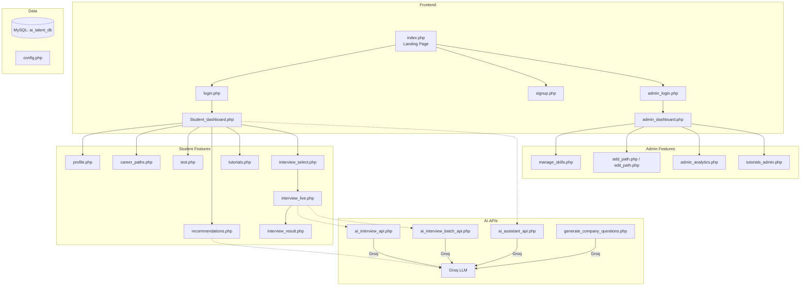

# 🧠 AI-Talent-Recommendation — Project Analysis

## Overview

**AI Powered Global Talent & Recommendation Engine** — a PHP/MySQL web application designed to help students prepare for job placements through AI-powered career guidance, mock interviews, skill assessments, and personalized learning recommendations.

| Attribute | Details |
|-----------|---------|
| **Stack** | PHP 7+, MySQL, HTML/CSS/JS (inline) |
| **Server** | XAMPP (MySQL port `3307`) |
| **AI Backend** | [Groq API](https://api.groq.com) — `llama-3.3-70b-versatile` |
| **Database** | `ai_talent_db` (SQL dump: 850 KB) |
| **Design** | Dark neon/glassmorphism theme, animated backgrounds |
| **Auth** | Session-based (student + admin roles) |

---

## Architecture Diagram



---

## File Inventory (44 files)

### 🏠 Core Pages

| File | Size | Purpose |
|------|------|---------|
| [index.php](file:///d:/projects/AI-Talent-Recommendation/index.php) | 14 KB | Landing page — hero, features, FAQ, company marquee, floating AI assistant |
| [login.php](file:///d:/projects/AI-Talent-Recommendation/login.php) | 3.1 KB | Student/admin login with glassmorphism card |
| [signup.php](file:///d:/projects/AI-Talent-Recommendation/signup.php) | 2.8 KB | Student registration |
| [admin_login.php](file:///d:/projects/AI-Talent-Recommendation/admin_login.php) | 2.6 KB | Admin-specific login |
| [logout.php](file:///d:/projects/AI-Talent-Recommendation/logout.php) | 90 B | Session destroy + redirect |

### 👨‍🎓 Student-Facing

| File | Size | Purpose |
|------|------|---------|
| [Student_dashboard.php](file:///d:/projects/AI-Talent-Recommendation/Student_dashboard.php) | 14 KB | Main student hub — profile, skills chart (Chart.js), career path, readiness score |
| [profile.php](file:///d:/projects/AI-Talent-Recommendation/profile.php) | 12 KB | Profile editor with photo upload, progress bar |
| [career_paths.php](file:///d:/projects/AI-Talent-Recommendation/career_paths.php) | 2.7 KB | Browse & select career paths |
| [test.php](file:///d:/projects/AI-Talent-Recommendation/test.php) | 2.5 KB | Skill assessment test |
| [submit_test.php](file:///d:/projects/AI-Talent-Recommendation/submit_test.php) | 932 B | Test submission handler |
| [result.php](file:///d:/projects/AI-Talent-Recommendation/result.php) | 18.6 KB | Test results display |
| [recommendations.php](file:///d:/projects/AI-Talent-Recommendation/recommendations.php) | 27 KB | **Largest file** — AI-generated recommendations with radar/bar charts, TTS, roadmap |
| [tutorials.php](file:///d:/projects/AI-Talent-Recommendation/tutorials.php) | 2.6 KB | Tutorial listings |
| [skills.php](file:///d:/projects/AI-Talent-Recommendation/skills.php) | 4.1 KB | Skill details view |

### 🎤 AI Interview System

| File | Size | Purpose |
|------|------|---------|
| [interview_select.php](file:///d:/projects/AI-Talent-Recommendation/interview_select.php) | 3.0 KB | Select role & difficulty for interview |
| [interview_live.php](file:///d:/projects/AI-Talent-Recommendation/interview_live.php) | 14.5 KB | **Live AI interview** — camera + face detection + speech recognition + TTS |
| [interview_result.php](file:///d:/projects/AI-Talent-Recommendation/interview_result.php) | 5.2 KB | Interview results display |
| [interview_history.php](file:///d:/projects/AI-Talent-Recommendation/interview_history.php) | 1.9 KB | Past interview sessions |
| [get_question.php](file:///d:/projects/AI-Talent-Recommendation/get_question.php) | 1.7 KB | Fetch interview questions API |
| [generate_company_questions.php](file:///d:/projects/AI-Talent-Recommendation/generate_company_questions.php) | 2.1 KB | Generate company-specific questions via Groq |

### 🔌 AI API Endpoints

| File | Size | Purpose |
|------|------|---------|
| [ai_assistant_api.php](file:///d:/projects/AI-Talent-Recommendation/ai_assistant_api.php) | 1.3 KB | Floating chatbot backend (Groq) |
| [ai_interview_api.php](file:///d:/projects/AI-Talent-Recommendation/ai_interview_api.php) | 1.4 KB | Single answer evaluation |
| [ai_interview_batch_api.php](file:///d:/projects/AI-Talent-Recommendation/ai_interview_batch_api.php) | 3.6 KB | Batch interview submission & scoring |

### 🛡️ Admin Panel

| File | Size | Purpose |
|------|------|---------|
| [admin_dashboard.php](file:///d:/projects/AI-Talent-Recommendation/admin_dashboard.php) | 5.0 KB | Career path management table |
| [admin_analytics.php](file:///d:/projects/AI-Talent-Recommendation/admin_analytics.php) | 7.1 KB | Analytics/statistics |
| [manage_skills.php](file:///d:/projects/AI-Talent-Recommendation/manage_skills.php) | 3.3 KB | CRUD for skills per career path |
| [add_path.php](file:///d:/projects/AI-Talent-Recommendation/add_path.php) / [edit_path.php](file:///d:/projects/AI-Talent-Recommendation/edit_path.php) | ~2.5 KB | Add/edit career paths |
| [add_skill.php](file:///d:/projects/AI-Talent-Recommendation/add_skill.php) / [edit_skill.php](file:///d:/projects/AI-Talent-Recommendation/edit_skill.php) | ~2.2 KB | Add/edit skills |
| [delete_path.php](file:///d:/projects/AI-Talent-Recommendation/delete_path.php) / [delete_skill.php](file:///d:/projects/AI-Talent-Recommendation/delete_skill.php) | ~335 B | Delete handlers |

### ⚙️ Config & Helpers

| File | Size | Purpose |
|------|------|---------|
| [config.php](file:///d:/projects/AI-Talent-Recommendation/config.php) | 506 B | DB connection + Groq API key |
| [database/connection.php](file:///d:/projects/AI-Talent-Recommendation/database/connection.php) | 261 B | Alternate DB connection (no port specified) |
| [career_skills.php](file:///d:/projects/AI-Talent-Recommendation/career_skills.php) | 1.7 KB | Hardcoded career → skills mapping |
| [aptitudes.php](file:///d:/projects/AI-Talent-Recommendation/aptitudes.php) | 1.2 KB | Aptitude data |
| [check_embeds.php](file:///d:/projects/AI-Talent-Recommendation/check_embeds.php) | 1.6 KB | Utility checks |
| [list_models.php](file:///d:/projects/AI-Talent-Recommendation/list_models.php) | 322 B | List Groq models |
| [select_path.php](file:///d:/projects/AI-Talent-Recommendation/select_path.php) | 472 B | Path selection handler |

---

## Key Features

### 1. 🤖 AI-Powered Career Recommendations
- Calls **Groq API** (`llama-3.3-70b-versatile`) with student's career, score, and skills
- Returns structured JSON: weak skills, learning priority, improvement points, 30-day roadmap, project suggestions
- Robust fallback to local heuristic if AI fails
- Visualized with **Chart.js** (radar + horizontal bar charts)
- Full **TTS (Text-to-Speech)** with voice selection, rate/pitch controls, word highlighting

### 2. 🎯 Live AI Interview
- Real-time **camera feed** with lightweight face/eye detection (canvas pixel analysis)
- Checks: camera ON, face visible, not obstructed, not looking away
- **Web Speech API** for both speech-to-text (recording answers) and text-to-speech (reading questions)
- Auto-speaks questions, captures answers, submits batch to AI for evaluation
- Echo cancellation built into microphone settings

### 3. 📊 Student Dashboard
- Career path selection with dynamic skills fetched from DB
- Bar chart of skill weights via Chart.js
- Latest test score and weak topics display
- "Readiness" percentage (currently randomized)

### 4. 🔐 Admin Panel
- CRUD operations for career paths and skills
- Analytics dashboard
- Tutorial management

---

## ⚠️ Security Concerns

> [!CAUTION]
> Several critical security issues exist:

| Issue | Location | Severity |
|-------|----------|----------|
| **SQL Injection** | `login.php:11`, `signup.php:11,15` — raw `$email` in queries | 🔴 Critical |
| **Hardcoded API Key** | `config.php:9` — Groq API key exposed in source | 🔴 Critical |
| **Plaintext Password Bypass** | `login.php:17` — `$user['password'] === '123456'` allows bypass | 🔴 Critical |
| **No CSRF Protection** | All forms lack CSRF tokens | 🟠 High |
| **XSS Potential** | Some user inputs echoed without `htmlspecialchars` | 🟠 High |
| **Duplicate DB Configs** | `config.php` (port 3307) vs `database/connection.php` (default port) — inconsistency | 🟡 Medium |

---

## 🔧 Technical Observations

> [!NOTE]
> **Positive patterns:**
> - Consistent dark neon/glassmorphism design language across all pages
> - Good use of prepared statements in `Student_dashboard.php` and `profile.php`
> - Comprehensive AI fallback system in `recommendations.php`
> - Responsive design with mobile breakpoints
> - Smooth animations and gradient backgrounds

> [!WARNING]
> **Issues to address:**
> - `admin_dashboard.php:181` has a stray `<li>` tag outside `</html>` (broken HTML)
> - `assets/css/`, `assets/js/`, `assets/images/` are all **empty** — all styles are inline
> - `README.MD` is empty — no project documentation
> - `Student_dashboard.php` uses capital `S` — may cause 404s on case-sensitive servers
> - "Readiness" score is `rand(60, 95)` — not computed from actual data
> - `database/connection.php` doesn't specify port 3307 like `config.php` does

---

## 📁 Directory Structure Summary

```
AI-Talent-Recommendation/
├── assets/
│   ├── css/                    (empty)
│   ├── js/                     (empty)
│   ├── images/                 (empty)
│   └── default_logo.png
├── database/
│   ├── ai_talent_db.sql        (850 KB - full DB dump)
│   └── connection.php
├── includes/
│   ├── header.php
│   └── footer.php
├── pages/
│   ├── add_tutorial.php
│   ├── admin_panel.php
│   ├── aptitude_test.php
│   └── tutorials_admin.php
├── uploads/
│   └── profile_photos/
├── config.php                  (DB + API key)
├── index.php                   (Landing page)
├── login.php / signup.php      (Auth)
├── Student_dashboard.php       (Student hub)
├── recommendations.php         (AI recommendations - 27KB, largest file)
├── interview_live.php          (Live AI interview with camera)
├── ai_*.php                    (AI API endpoints)
├── admin_*.php                 (Admin pages)
└── ... (39 PHP files total)
```

---

## Database Tables (inferred from code)

| Table | Key Columns |
|-------|-------------|
| `users` | id, name, email, password, role, selected_path, fullname, phone, education, experience, skills, profile_photo, profile_completed |
| `career_paths` | id, name, description |
| `skills` | id, career_path_id, skill_name, weight |
| `user_scores` | user_id, career_path_id, score, total, weak_topics, created_at |

---

## Summary

This is a **feature-rich but early-stage** PHP application with a sophisticated AI integration layer and polished dark-theme UI. The core flow — sign up → pick career → take test → get AI recommendations → practice interviews — is well-structured. However, it has **critical security vulnerabilities** (SQL injection, exposed API key, password bypass) that must be fixed before any deployment. The codebase would also benefit from extracting inline CSS/JS into external files, adding CSRF protection, and filling out the empty README.
